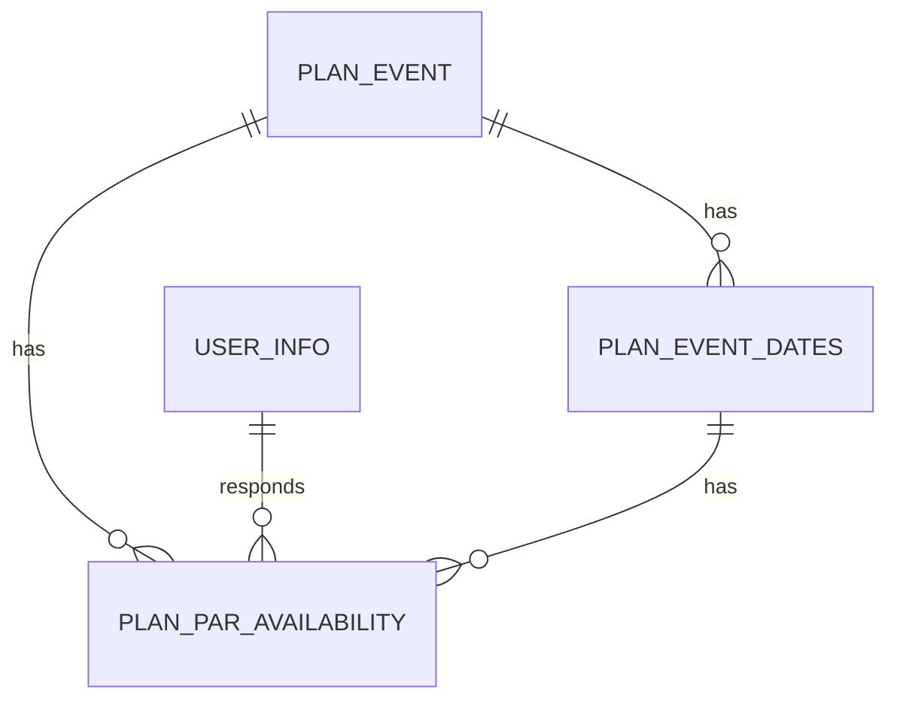

# Supabase Database Schema

## Tables Overview

### PLAN_EVENT (日程調整イベント)
| Column | Type | Nullable | Default |
|--------|------|----------|----------|
| plan_id | bigint | NO | null |
| plan_title | text | NO | null |
| description | text | YES | null |
| status | text | YES | null |
| created_by | bigint | YES | null |
| created_at | timestamp without time zone | YES | null |
| updated_at | timestamp without time zone | YES | null |

**Foreign Keys**: None

### PLAN_EVENT_DATES (日程候補)
| Column | Type | Nullable | Default |
|--------|------|----------|----------|
| date_id | bigint | NO | null |
| plan_id | bigint | NO | null |
| datetime | timestamp without time zone | YES | null |
| created_at | timestamp without time zone | YES | null |

**Foreign Keys**:
- plan_id -> PLAN_EVENT.plan_id

### PLAN_PAR_AVAILABILITY (参加可否)
| Column | Type | Nullable | Default |
|--------|------|----------|----------|
| par_id | bigint | NO | null |
| plan_id | bigint | YES | null |
| date_id | bigint | NO | null |
| emp_no | bigint | NO | null |
| availability | text | NO | null |
| created_at | timestamp without time zone | YES | null |
| updated_at | timestamp without time zone | YES | null |

**Foreign Keys**:
- emp_no -> USER_INFO.emp_no
- plan_id -> PLAN_EVENT.plan_id

### USER_INFO (ユーザー情報)
| Column | Type | Nullable | Default |
|--------|------|----------|----------|
| emp_no | bigint | NO | null |
| myoji | text | YES | null |
| namae | text | YES | null |
| last_nm | text | YES | null |
| first_nm | text | YES | null |
| gender | text | NO | '1'::text |
| email | text | YES | null |
| act_kbn | boolean | NO | true |
| login_count | bigint | YES | '0'::bigint |
| birthday | date | YES | null |
| icon_url | text | YES | null |

**Foreign Keys**: None

## リレーションシップ図

## 主要テーブルの説明

1. PLAN_EVENT
   - 日程調整イベントの基本情報を管理
   - タイトル、説明、作成者などを保持

2. PLAN_EVENT_DATES
   - 各イベントの候補日時を管理
   - PLAN_EVENTに紐づく

3. PLAN_PAR_AVAILABILITY
   - ユーザーの参加可否情報を管理
   - USER_INFOとPLAN_EVENTに紐づく

4. USER_INFO
   - ユーザーの基本情報を管理
   - 他のテーブルから参照される

# Supabase Table Information

## ALL_USER_M
| Column | Type | Nullable | Default |
|--------|------|----------|----------|
| emp_no | bigint | NO | null |
| email | text | NO | null |
| act_kbn | boolean | YES | null |

**Foreign Keys**: None

## CONTACT_REPORTS
| Column | Type | Nullable | Default |
|--------|------|----------|----------|
| id | bigint | NO | null |
| category | text | NO | null |
| title | text | YES | null |
| description | text | YES | null |
| email | text | YES | null |
| status | text | YES | 'pending'::text |
| created_at | timestamp without time zone | YES | null |
| updated_at | timestamp without time zone | YES | null |
| resolved_at | timestamp without time zone | YES | null |
| resolved_by | bigint | YES | null |
| response | text | YES | null |

**Foreign Keys**: None

## EMP_CIZ
| Column | Type | Nullable | Default |
|--------|------|----------|----------|
| ciz_id | bigint | NO | null |
| emp_no | bigint | NO | null |
| total_ciz | bigint | NO | null |
| updated_at | timestamp without time zone | YES | null |
| updated_by | text | YES | null |
| act_kbn | boolean | NO | true |

**Foreign Keys**:
- emp_no -> USER_INFO.emp_no

## EMP_CIZ_HISTORY
| Column | Type | Nullable | Default |
|--------|------|----------|----------|
| history_id | bigint | NO | null |
| emp_no | bigint | NO | null |
| change_type | text | YES | ''::text |
| ciz | bigint | YES | null |
| event_id | bigint | YES | null |
| reason | text | YES | null |
| created_at | timestamp without time zone | YES | null |
| created_by | text | YES | null |
| act_kbn | boolean | NO | true |

**Foreign Keys**:
- emp_no -> USER_INFO.emp_no

## EVENT_LIST
| Column | Type | Nullable | Default |
|--------|------|----------|----------|
| event_id | bigint | NO | null |
| title | text | NO | null |
| owner | bigint | YES | null |
| start_date | timestamp without time zone | YES | null |
| end_date | timestamp without time zone | YES | null |
| created_at | timestamp without time zone | YES | null |
| created_by | bigint | YES | null |
| updated_at | timestamp without time zone | YES | null |
| updated_by | bigint | YES | null |
| act_kbn | boolean | NO | true |
| description | text | YES | null |
| genre | text | YES | null |
| repeat_id | bigint | YES | null |
| abbreviation | text | YES | null |
| format | text | YES | null |
| url | text | YES | null |
| venue_radius | bigint | YES | null |
| venue_id | bigint | YES | null |
| manage_member | text | YES | null |

**Foreign Keys**:
- venue_id -> EVENT_VENUE.venue_id

## EVENT_PARTICIPATION
| Column | Type | Nullable | Default |
|--------|------|----------|----------|
| emp_no | bigint | NO | null |
| official_count | bigint | NO | null |
| unofficial_count | bigint | YES | null |
| updated_at | timestamp without time zone | YES | null |

**Foreign Keys**:
- emp_no -> USER_INFO.emp_no

## EVENT_PAR_HISTORY
| Column | Type | Nullable | Default |
|--------|------|----------|----------|
| history_id | bigint | NO | null |
| emp_no | bigint | YES | null |
| event_id | bigint | NO | null |
| participated_at | timestamp without time zone | YES | null |
| format | text | YES | null |

**Foreign Keys**:
- emp_no -> USER_INFO.emp_no
- event_id -> EVENT_LIST.event_id

## EVENT_TEMP_ENTRY
| Column | Type | Nullable | Default |
|--------|------|----------|----------|
| entry_id | bigint | NO | null |
| event_id | bigint | NO | null |
| emp_no | bigint | YES | null |
| status | text | YES | null |
| updated_at | timestamp without time zone | YES | now() |
| format | text | YES | null |

**Foreign Keys**:
- event_id -> EVENT_LIST.event_id
- emp_no -> USER_INFO.emp_no

## EVENT_VENUE
| Column | Type | Nullable | Default |
|--------|------|----------|----------|
| venue_id | bigint | NO | null |
| venue_nm | text | NO | null |
| address | text | YES | null |
| latitude | numeric | YES | null |
| longitude | numeric | YES | null |

**Foreign Keys**: None

## USER_ROLE
| Column | Type | Nullable | Default |
|--------|------|----------|----------|
| role_id | bigint | NO | null |
| role | text | YES | null |
| updated_at | timestamp without time zone | YES | null |
| updated_by | text | YES | null |
| act_kbn | boolean | NO | true |
| emp_no | bigint | YES | null |

**Foreign Keys**:
- emp_no -> USER_INFO.emp_no